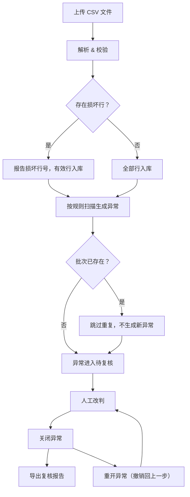

## 1. 产品概述
本地抄表异常复核台，面向电力/水务/燃气等公用事业抄表业务场景，用于批量导入抄表读数、按可配置规则自动识别异常、人工改判与关闭/重开异常，并导出复核报告。所有数据本地持久化，程序重启后状态完全一致。
- 解决抄表异常从发现到复核的闭环管理问题，避免异常遗漏和重复处理
- 目标用户：抄表业务复核员、质检主管

## 2. 核心功能

### 2.1 用户角色
| 角色 | 使用方式 | 核心权限 |
|------|----------|----------|
| 复核员 | 直接打开本地应用 | 导入批次、查看异常、改判、关闭/重开、导出报告 |
| 管理员 | 同上 | 额外可配置规则、管理规则版本 |

### 2.2 功能模块
1. **批次导入页**：CSV 文件上传、批次列表、导入结果概览（含行号级错误报告）
2. **规则配置页**：异常规则 CRUD、规则版本管理、启用/禁用规则
3. **异常复核页**：异常列表（按规则归类）、筛选/搜索、人工改判、备注、关闭/重开操作
4. **复核报告页**：统计概览、明细导出（CSV/JSON）、报告口径一致性保证

### 2.3 页面详情
| 页面名称 | 模块名称 | 功能描述 |
|----------|----------|----------|
| 批次导入页 | 文件上传区 | 拖拽或点击上传 CSV，解析预览，显示有效行数与错误行号 |
| 批次导入页 | 批次历史列表 | 展示已导入批次，显示批次号、导入时间、有效/错误行数、异常数 |
| 批次导入页 | 导入结果弹窗 | 导入完成后弹出，列出损坏行号及原因，确认后写入数据库 |
| 规则配置页 | 规则列表 | 展示所有规则（名称、类型、阈值、版本号、启用状态） |
| 规则配置页 | 规则编辑器 | 新增/编辑规则，支持类型：读数突增、读数为负、读数回退、用量超限、空值检测 |
| 规则配置页 | 版本历史 | 每次规则变更生成新版本号，可查看历史版本和回滚 |
| 异常复核页 | 异常筛选栏 | 按批次、规则类型、状态（待复核/已改判/已关闭）筛选 |
| 异常复核页 | 异常列表 | 表格展示异常记录，每行含：表号、批次、读数、异常类型、状态、改判信息 |
| 异常复核页 | 改判面板 | 侧滑面板：选择改判结果（确认异常/误报）、填写改判原因、备注 |
| 异常复核页 | 操作按钮 | 关闭异常、重开已关闭异常（撤销回上一步） |
| 复核报告页 | 统计概览 | 总异常数、待复核/已改判/已关闭数、各类异常占比 |
| 复核报告页 | 导出功能 | 导出 CSV/JSON 格式复核报告，含统计口径说明 |

## 3. 核心流程

**主流程**：复核员上传 CSV → 系统按当前生效规则自动识别异常 → 异常进入待复核状态 → 复核员逐条或批量改判（确认异常/误报）→ 关闭已确认异常 → 导出复核报告

**失败链路**：
- CSV 中某行读数列损坏 → 报出具体行号，其余有效行正常入库
- 重复导入同一批次 → 检测到批次号重复，跳过不生成新异常
- 已关闭异常需重新处理 → 点击重开，状态回退到改判前状态

## 4. 用户界面设计

### 4.1 设计风格
- 主色调：深靛蓝 (#1e293b) + 琥珀色强调 (#f59e0b)
- 按钮风格：圆角 (rounded-lg)，主操作实心填充，次要操作描边
- 字体：思源黑体 / Noto Sans SC，标题 20px/16px，正文 14px，辅助 12px
- 布局风格：左侧导航栏 + 右侧内容区，卡片式模块
- 图标风格：Lucide 线性图标

### 4.2 页面设计概览
| 页面名称 | 模块名称 | UI 元素 |
|----------|----------|---------|
| 批次导入页 | 文件上传区 | 虚线拖拽区，上传图标，进度条，状态提示 |
| 批次导入页 | 批次历史列表 | 表格：批次号、时间、有效/错误行、异常数，操作列 |
| 规则配置页 | 规则列表 | 卡片列表，每张卡片含规则名、类型标签、版本号、开关 |
| 规则配置页 | 规则编辑器 | 侧滑面板，表单字段+阈值滑块+预览区域 |
| 异常复核页 | 异常列表 | 表格+行内状态标签（琥珀色待复核/绿色已改判/灰色已关闭） |
| 异常复核页 | 改判面板 | 侧滑面板，下拉选择+文本域+提交按钮 |
| 复核报告页 | 统计概览 | 4 张统计卡片 + 饼图/柱状图 |
| 复核报告页 | 导出功能 | 格式选择下拉 + 导出按钮 |

### 4.3 响应式
桌面优先设计，最小支持 1280px 宽度。表格在小屏幕下水平滚动。

### 4.4 3D 场景
不适用
