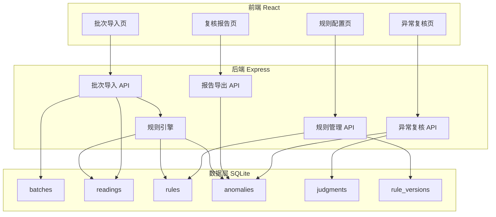
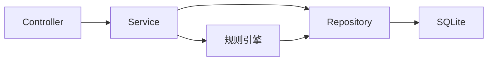
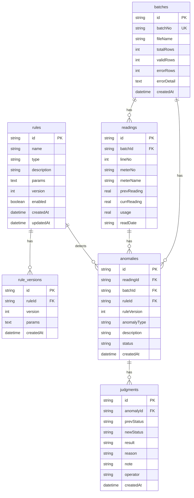

## 1. 架构设计



## 2. 技术说明
- 前端：React@18 + TypeScript + Tailwind CSS@3 + Vite + Zustand
- 初始化工具：vite-init
- 后端：Express@4 + TypeScript（ESM）
- 数据库：SQLite（better-sqlite3），本地文件存储，程序重启后数据完整保留
- CSV 解析：papaparse
- 图表：recharts

## 3. 路由定义
| 路由 | 用途 |
|------|------|
| / | 批次导入页，首页 |
| /rules | 规则配置页 |
| /review | 异常复核页 |
| /report | 复核报告页 |

## 4. API 定义

### 4.1 批次导入
- `POST /api/batches/import` — 上传 CSV 并导入，返回 { batchId, validRows, errors: [{line, reason}], anomaliesCreated }
- `GET /api/batches` — 批次列表
- `GET /api/batches/:id` — 批次详情

### 4.2 规则管理
- `GET /api/rules` — 规则列表（含版本号、启用状态）
- `POST /api/rules` — 新增规则（自动生成新版本号）
- `PUT /api/rules/:id` — 编辑规则（生成新版本号，旧版本保留）
- `PATCH /api/rules/:id/toggle` — 启用/禁用规则
- `GET /api/rules/:id/versions` — 规则版本历史

### 4.3 异常复核
- `GET /api/anomalies` — 异常列表（支持筛选：batchId, ruleId, status）
- `POST /api/anomalies/:id/judge` — 改判（body: { result, reason, note }），写入 judgments 表
- `POST /api/anomalies/:id/close` — 关闭异常
- `POST /api/anomalies/:id/reopen` — 重开异常（撤销回上一步，恢复前一状态）

### 4.4 报告导出
- `GET /api/report/summary` — 统计概览
- `GET /api/report/export?format=csv|json` — 导出复核报告

### 4.5 TypeScript 类型
```typescript
interface Batch {
  id: string;
  batchNo: string;
  fileName: string;
  totalRows: number;
  validRows: number;
  errorRows: number;
  errorDetail: string; // JSON: [{line, reason}]
  createdAt: string;
}

interface Reading {
  id: string;
  batchId: string;
  lineNo: number;
  meterNo: string;
  meterName: string;
  prevReading: number | null;
  currReading: number | null;
  usage: number | null;
  readDate: string | null;
}

interface Rule {
  id: string;
  name: string;
  type: 'spike' | 'negative' | 'rollback' | 'overlimit' | 'null_value';
  description: string;
  params: Record<string, number | string>;
  version: number;
  enabled: boolean;
  createdAt: string;
  updatedAt: string;
}

interface RuleVersion {
  id: string;
  ruleId: string;
  version: number;
  params: Record<string, number | string>;
  createdAt: string;
}

interface Anomaly {
  id: string;
  readingId: string;
  batchId: string;
  ruleId: string;
  ruleVersion: number;
  anomalyType: string;
  description: string;
  status: 'pending' | 'confirmed' | 'false_positive' | 'closed';
  createdAt: string;
}

interface Judgment {
  id: string;
  anomalyId: string;
  prevStatus: string;
  newStatus: string;
  result: 'confirm' | 'false_positive';
  reason: string;
  note: string;
  operator: string;
  createdAt: string;
}
```

## 5. 服务端架构图



## 6. 数据模型

### 6.1 数据模型定义



### 6.2 数据定义语言

```sql
CREATE TABLE IF NOT EXISTS batches (
  id TEXT PRIMARY KEY,
  batchNo TEXT UNIQUE NOT NULL,
  fileName TEXT NOT NULL,
  totalRows INTEGER NOT NULL DEFAULT 0,
  validRows INTEGER NOT NULL DEFAULT 0,
  errorRows INTEGER NOT NULL DEFAULT 0,
  errorDetail TEXT DEFAULT '[]',
  createdAt TEXT NOT NULL DEFAULT (datetime('now'))
);

CREATE TABLE IF NOT EXISTS readings (
  id TEXT PRIMARY KEY,
  batchId TEXT NOT NULL REFERENCES batches(id),
  lineNo INTEGER NOT NULL,
  meterNo TEXT NOT NULL,
  meterName TEXT DEFAULT '',
  prevReading REAL,
  currReading REAL,
  usage REAL,
  readDate TEXT,
  UNIQUE(batchId, lineNo)
);

CREATE TABLE IF NOT EXISTS rules (
  id TEXT PRIMARY KEY,
  name TEXT NOT NULL,
  type TEXT NOT NULL CHECK(type IN ('spike','negative','rollback','overlimit','null_value')),
  description TEXT DEFAULT '',
  params TEXT DEFAULT '{}',
  version INTEGER NOT NULL DEFAULT 1,
  enabled INTEGER NOT NULL DEFAULT 1,
  createdAt TEXT NOT NULL DEFAULT (datetime('now')),
  updatedAt TEXT NOT NULL DEFAULT (datetime('now'))
);

CREATE TABLE IF NOT EXISTS rule_versions (
  id TEXT PRIMARY KEY,
  ruleId TEXT NOT NULL REFERENCES rules(id),
  version INTEGER NOT NULL,
  params TEXT DEFAULT '{}',
  createdAt TEXT NOT NULL DEFAULT (datetime('now')),
  UNIQUE(ruleId, version)
);

CREATE TABLE IF NOT EXISTS anomalies (
  id TEXT PRIMARY KEY,
  readingId TEXT NOT NULL REFERENCES readings(id),
  batchId TEXT NOT NULL REFERENCES batches(id),
  ruleId TEXT NOT NULL REFERENCES rules(id),
  ruleVersion INTEGER NOT NULL,
  anomalyType TEXT NOT NULL,
  description TEXT DEFAULT '',
  status TEXT NOT NULL DEFAULT 'pending' CHECK(status IN ('pending','confirmed','false_positive','closed')),
  createdAt TEXT NOT NULL DEFAULT (datetime('now'))
);

CREATE TABLE IF NOT EXISTS judgments (
  id TEXT PRIMARY KEY,
  anomalyId TEXT NOT NULL REFERENCES anomalies(id),
  prevStatus TEXT NOT NULL,
  newStatus TEXT NOT NULL,
  result TEXT NOT NULL CHECK(result IN ('confirm','false_positive','reopen')),
  reason TEXT DEFAULT '',
  note TEXT DEFAULT '',
  operator TEXT DEFAULT '复核员',
  createdAt TEXT NOT NULL DEFAULT (datetime('now'))
);

CREATE INDEX IF NOT EXISTS idx_readings_batch ON readings(batchId);
CREATE INDEX IF NOT EXISTS idx_anomalies_batch ON anomalies(batchId);
CREATE INDEX IF NOT EXISTS idx_anomalies_status ON anomalies(status);
CREATE INDEX IF NOT EXISTS idx_anomalies_rule ON anomalies(ruleId);
CREATE INDEX IF NOT EXISTS idx_judgments_anomaly ON judgments(anomalyId);
CREATE INDEX IF NOT EXISTS idx_rule_versions_rule ON rule_versions(ruleId);

-- 默认规则初始数据
INSERT OR IGNORE INTO rules (id, name, type, description, params, version, enabled) VALUES
  ('r1', '读数突增', 'spike', '当期用量超过上期用量的指定倍数', '{"multiplier": 3}', 1, 1),
  ('r2', '读数为负', 'negative', '当前读数为负数', '{}', 1, 1),
  ('r3', '读数回退', 'rollback', '当前读数小于上期读数', '{}', 1, 1),
  ('r4', '用量超限', 'overlimit', '当期用量超过指定阈值', '{"limit": 9999}', 1, 1),
  ('r5', '空值检测', 'null_value', '当前读数为空或无法解析', '{}', 1, 1);

INSERT OR IGNORE INTO rule_versions (id, ruleId, version, params) VALUES
  ('rv1', 'r1', 1, '{"multiplier": 3}'),
  ('rv2', 'r2', 1, '{}'),
  ('rv3', 'r3', 1, '{}'),
  ('rv4', 'r4', 1, '{"limit": 9999}'),
  ('rv5', 'r5', 1, '{}');
```
